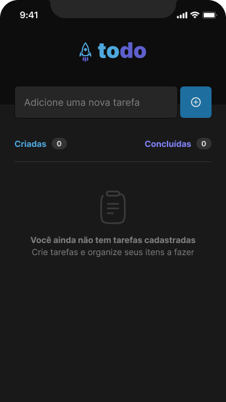

# Desafio 1 - React Native - To Do list

Uma aplicação mobile utilizando React Native. Objetivo de concluir o Desafio proposto no Ignite da Rockeseat. Onde o usuário irá cadastrar uma lista de tarefas, retornando uma soma de tarefas e as concluídas também. Adicionado validação para não aceitar tarefas repetidas nem em branco.

## Tecnologias 💻

- React Native
- Expo
- Tailwind

## Screenshots

<p align="center">


</p>

## Licença

[](https://choosealicense.com/licenses/mit/)

## Clonar repositório

Clonar projeto

```bash
  git clone https://github.com/Jtomio/react-native-todo-challenge
```

Abrir a pasta

```bash
  cd react-native-todo-challenge
```

Instalar dependência

```bash
  npm install
```

Rodar no Expo

```bash
  npx expo start
```

## Authors

- Jeison Tomio
- [@Jtomio](https://www.github.com/Jtomio)

## 🔗 Links

[](https://portfoliojeison.vercel.app/)

[](https://www.linkedin.com/in/jeison-tomio/)
